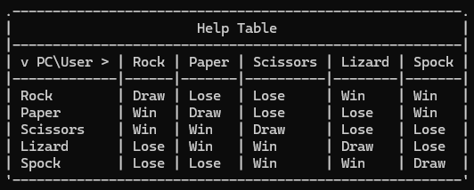

# Generalized Secure Rock-Paper-Scissors Game

This project implements a **generalized and secure version** of the classic Rock-Paper-Scissors game using **HMAC (SHA-256)** for cryptographic fairness. The game allows an arbitrary odd number of moves, ensuring the computer cannot cheat by providing a cryptographically secure key and HMAC before the player makes their choice.

## Features
- Supports **arbitrary odd-numbered moves** (e.g., Rock-Paper-Scissors, Rock-Paper-Scissors-Lizard-Spock, or more).
- Ensures **game fairness** using cryptographic HMACs (SHA-256).
- Displays a **help table** showing the results between all moves.
- Works from the **command line** using any custom set of moves.
  
## How It Works
1. The computer generates a **cryptographically secure key** and uses it to create an HMAC of its move.
2. The **HMAC** is displayed to the player before they choose their move.
3. The player selects their move from a menu.
4. The winner is determined based on the circular order of the moves.
5. After the game, the original key is revealed, so the player can verify that the computer’s move was not changed.

## Installation
1. Clone the repository:
    ```bash
    git clone https://github.com/<your-username>/Generalized-Secure-RPS.git
    cd Generalized-Secure-RPS
    ```
2. Run the following command to install the required package:
   ```
   npm install ascii-table
   ```
3. Run the game using Node.js:
    ```bash
    node game.js Rock Paper Scissors
    ```

   Or use any odd number of custom moves, for example:
    ```bash
    node game.js Rock Paper Scissors Lizard Spock
    ```

## Usage
- The game takes an **odd number of moves** as command-line arguments.
- Use `0` to exit the game.
- Use `?` to display a **help table** showing which moves win or lose.
- After the game, the **key** is revealed to verify the computer's move.

## Example:
```bash
$ node game.js Rock Paper Scissors Lizard Spock
HMAC: <hmac_value>
Available moves:
1 - Rock
2 - Paper
3 - Scissors
4 - Lizard
5 - Spock
0 - Exit
? - Help
Enter your move: 2
Your move: Paper
Computer's move: Scissors
Computer Wins
HMAC Key: <key_value>
```

## Help Table Screenshot


## Dependencies
- Node.js
- Crypto module (built-in with Node.js)
- ascii-table (for generating the help table)

## License
This project is licensed under the MIT License.
